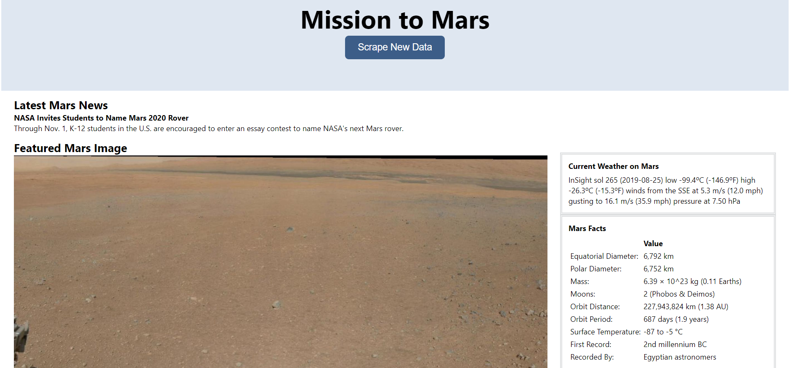
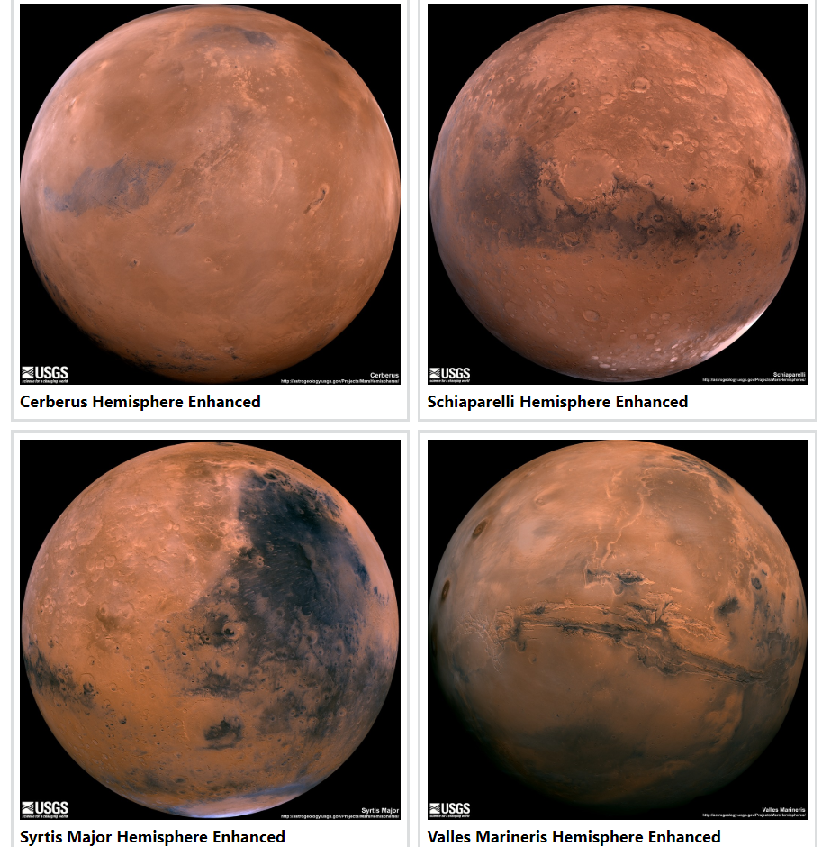

# Latest Mars News

    Data to be scrapped from NASA Mars web portal by a click of a button and retrieved data then written into a PostgreSQL database to be displayed in a HTML page. 
    HTML5 Grid Layout used extensivly in this webpage.

