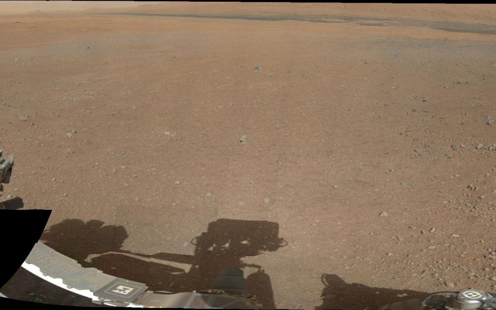

Mission to Mars

[Scrape New Data](http://127.0.0.1:5000/scrape)

Latest Mars News
----------------

#### NASA Invites Students to Name Mars 2020 Rover

Through Nov. 1, K-12 students in the U.S. are encouraged to enter an
essay contest to name NASA's next Mars rover.

Featured Mars Image
-------------------

#### Current Weather on Mars

InSight sol 265 (2019-08-25) low -99.4ºC (-146.9ºF) high -26.3ºC
(-15.3ºF) winds from the SSE at 5.3 m/s (12.0 mph) gusting to 16.1 m/s
(35.9 mph) pressure at 7.50 hPa

#### Mars Facts

                         Value
  ---------------------- --------------------------------
  Equatorial Diameter:   6,792 km
  Polar Diameter:        6,752 km
  Mass:                  6.39 × 10\^23 kg (0.11 Earths)
  Moons:                 2 (Phobos & Deimos)
  Orbit Distance:        227,943,824 km (1.38 AU)
  Orbit Period:          687 days (1.9 years)
  Surface Temperature:   -87 to -5 °C
  First Record:          2nd millennium BC
  Recorded By:           Egyptian astronomers

Mars Hemispheres
----------------

#### Cerberus Hemisphere Enhanced

.jpg)

#### Schiaparelli Hemisphere Enhanced

.jpg)

#### Syrtis Major Hemisphere Enhanced

.jpg)

#### Valles Marineris Hemisphere Enhanced

**
